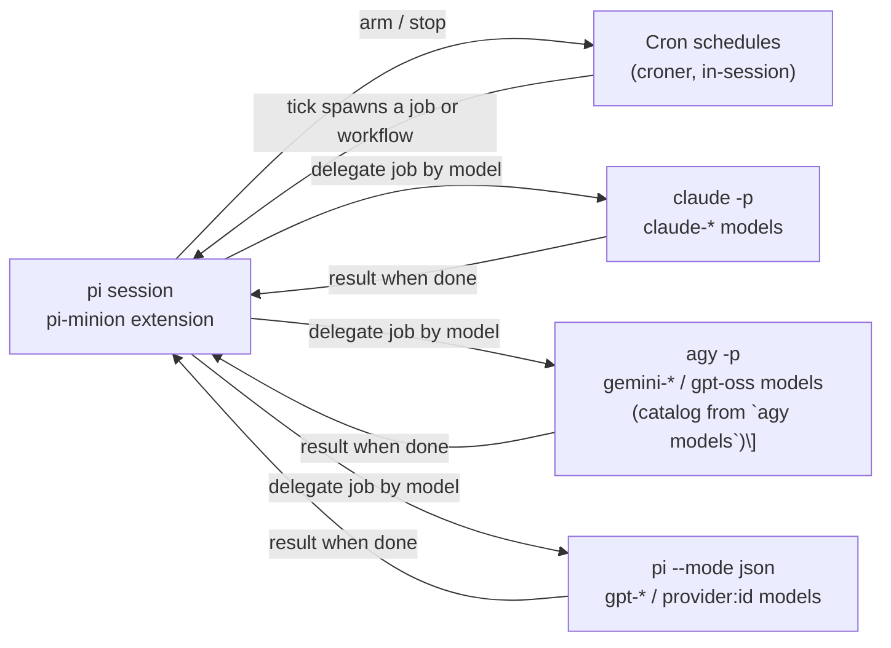

# pi-minion

A [Pi](https://pi.dev) extension that delegates tasks to a background minion
process — `claude`, `agy`, or `pi`, whichever CLI owns the requested model —
so the primary session isn't blocked while the minion works.

## Architecture



Each delegation spawns a detached headless CLI chosen by which adapter owns
the requested model; results are pushed back into the session when it exits —
no polling. `schedule_pi_minion` automates the same call on a cron, and
workflows fan out one job per step.

Model catalogs are live everywhere: pi's adapter routes against the parent
session's model registry, and agy's adapter parses
`agy --output-format=json models` at session start (claude ids in that output
are filtered out — they stay owned by the claude adapter). Short aliases like
`gemini-flash` are derived from agy's catalog, not hardcoded — a new Gemini
or GPT-OSS release needs no code change. Aliases resolve to the latest
version's id with the requested (or nearest, higher-preferring) effort
suffix; a failed catalog refresh keeps the last snapshot, and a CLI that
isn't installed simply owns nothing.

## Tools & features

### Delegate a task

**`run_pi_minion(task, model, effort, context, maxBudgetUsd?)`** — spawn a
background job. Spawns `claude -p --permission-mode auto ...` as a detached
child process and returns a job ID immediately, so your session keeps working
while the minion runs. The result arrives later as a transcript message plus a
collapsible `pi-minion-display` entry.

- Deliberately no status/result-check tool: results are pushed to you. If you
  find pi-minion job IDs fed to a *different* extension's subagent tools
  (`get_subagent_result`, `Agent`, `steer_subagent`), see
  [TROUBLESHOOTING.md](./TROUBLESHOOTING.md).
- Jobs are stateless, so `context` is required on every call: restate the
  prior findings/decisions this task depends on verbatim, or pass exactly
  `"No prior context."` — mixing the escape hatch with other details is
  rejected.

**`list_pi_minions()`** — list this session's jobs. Shows running and recently
finished jobs in the current workspace with each job's `id`, `title`, `model`,
`effort`, `status`, and `reportPath`. Use it to recover a job ID after context
compaction, or to find a finished job's `reportPath` before writing `context`
for a follow-up task.

### Schedule jobs

**`schedule_pi_minion(task, model, effort, context, maxBudgetUsd?, cron)`** —
run the same request on a cron schedule (local time, 5 or 6 fields, via
[croner](https://github.com/hexagon/croner)).

- Each tick spawns an ordinary `run_pi_minion` job; its result posts to the
  transcript and context without starting a main-agent turn (you'll see it on
  your next prompt). A spawn failure does start one.
- A tick is skipped (logged `status=skipped`) while the previous run is still
  going.
- A run can end its own schedule: it's told to finish its reply with
  `[[STOP_SCHEDULE]]` alone on the last line once the goal is fully complete.
  That result posts with a "Schedule stopped" note and does start a turn
  (logged `status=unscheduled`, `self_stop`).
- Schedules live in memory only and stop when their session quits.

**`list_pi_minion_schedules()` / `cancel_pi_minion_schedule(id)`** — list or
stop this session's schedules. Stopping a schedule doesn't kill a run already
in progress; cancel the job itself with `cancel_pi_minion` and its
`lastJobId` (or `cancel_pi_minion_workflow` with `lastWorkflowId` for a
workflow schedule).

### Run workflows

**`run_pi_minion_workflow(title, context, maxBudgetUsd?, steps)`** — run a
small dependency graph of minion jobs: `steps: [{ id, task, model, effort,
dependsOn?, maxBudgetUsd? }]`, at most 10, up to 4 running at once. A step
starts as soon as its `dependsOn` steps are done and receives their results.

- A step's task inlines a dependency's output where it says
  `{{steps.<id>.result}}` (the id must be in its `dependsOn`); any dependency
  without a placeholder is appended as `Result of step <id>:` at the end.
- Large results become a preview plus a pointer to the full file; one step's
  inlined results together stay within `maxResultPreviewBytes`, split across
  its dependencies. A `dependsOn` listing the same id twice is rejected.
- Before anything spawns, a confirm dialog lists the steps grouped into
  stages with their models, efforts, waits, and the total budget. It starts
  on "No"; declining runs nothing, and a session without a UI refuses.
- The budget cap sums only steps whose agent enforces `maxBudgetUsd`; steps
  on pi or agy are marked "no cost ceiling" and counted separately.
- Steps post no end-of-job message; one summary at the end (per-step status,
  model, `token_usage`, `cost_usd`, `reportPath`) starts the single main-agent
  turn.
- A failed, skipped, or cancelled step skips its dependents while independent
  branches keep going.

Either the agent proposes a workflow in chat first, or you ask for one ("use
a workflow ..."). Workflows live in memory only and stop when their session
quits.

**`list_pi_minion_workflows()` / `cancel_pi_minion_workflow(id)`** — list this
session's workflows (status plus each step's `jobId` and `reportPath`), or
cancel one: pending steps are cancelled, running steps are stopped, and the
summary posts quietly.

**`schedule_pi_minion_workflow(title, context, maxBudgetUsd?, steps, cron)`** —
run `run_pi_minion_workflow` on a cron schedule.

- The graph, every step, and the cron are checked once up front; the confirm
  dialog (which adds the cron, next run, and per-run budget) is the only
  approval — later ticks never ask again.
- Each tick starts a fresh workflow, skipped (logged `status=skipped`) while
  the previous one is still going. Its summary posts without starting a turn
  unless no step of the run succeeded, in which case it starts one and says
  so.
- Each step's budget cap is fixed when the schedule is approved, not re-read
  from `pi-minion.json` on later runs.
- The workflow must have exactly one final step (one no other step depends
  on); only that step is told it can end the schedule with `[[STOP_SCHEDULE]]`
  — its summary posts with a "Schedule stopped" note and starts a turn
  (logged `status=unscheduled`, `self_stop`).
- `list_pi_minion_schedules` shows `kind` and `lastWorkflowId`, the picker
  marks scheduled-workflow rows `⏱⇉`, and `cancel_pi_minion_schedule` stops future ticks.
  A session without a UI refuses.

### In the UI

**`/pi-minions` command (default key `alt+j`, see `shortcut` in
`pi-minion.json`)** — opens a picker over currently running jobs (including
runs started by a schedule), then a scrollable detail modal with the job's
full streamed output. This session's schedules are listed after them as
`⏱ <title> · <model> / <effort> · <cron> · next <time>`; picking one asks to
stop it. Running workflows are listed first as
`⇉ <title> · <done>/<total> steps · <running step ids>`; picking one asks to
cancel it.

**Live status widget** — while jobs are in flight, an `aboveEditor` tree view
lists them with a spinner, elapsed time, and the latest streamed line, under
a `π minions · N jobs · N workflows` root row. A running workflow shows as a
`⇉` row (stage, steps done, elapsed) with its steps nested under it: `○`
pending, `✓` done, `✗` failed, `–` skipped/cancelled, plus the running step's
live row. Self-heals across `/reload`, `/new`, fork, and `switchSession` — a
job that outlives one of those keeps rendering instead of going permanently
blank (see TROUBLESHOOTING.md if it ever doesn't).

### Records

**Lifecycle log** — `~/.pi/agent/pi-minion.log` gets one terse line per job
started/exited/errored/cancelled, schedule scheduled/skipped/unscheduled, and
workflow started/finished/cancelled/declined — never stdout/stderr or UI
events. Rolls over to `pi-minion.log.1` once it would exceed 15MB.

**Sub-sessions** — every finished job is written as a pi session named
`<model>: <title>` (task as the user message, result plus per-model usage as
assistant messages), threaded under the calling session in `/resume`. A
calling session with no file (in-memory) writes instead to
`~/.pi/agent/sessions/pi-minion/<YYYY-MM>/`, which `/resume` doesn't list. A
workflow gets its own `⇉ <title>` session under the calling session — its
plan when it starts, its summary when it finishes, at zero usage so `/usage`
counts each step once — with its steps' sessions, named `<model>: <step id>`,
threaded under it. Either way,
[pi-usage-extension](https://github.com/tmustier/pi-extensions/tree/main/usage-extension)'s
`/usage` shows its tokens/cost under provider `claude`/`agy`/`pi` with the
real model id. Sessions are never pruned: job pruning only removes
`~/.pi/agent/pi-minion/<job id>/`.

## Requirements

- [Pi](https://pi.dev) (developed and tested against pi 1.0.1)
- At least one agent CLI on your `PATH` and logged in — `claude`, `agy`, or
  `pi` — for the models you want to delegate to (jobs run as headless CLI
  sessions).

## Installation

### As a pi package (recommended)

```bash
pi install git:github.com/junkfactory/pi-minion
```

Pi clones the repo, installs its runtime dependencies (`croner`), and loads
`src/pi-minion.ts` directly — there is no build step. Manage the install with
`pi list` / `pi remove`; pin a tag with
`pi install git:github.com/junkfactory/pi-minion@v0.1.0` if you prefer.

### From a local clone (development)

```bash
git clone https://github.com/junkfactory/pi-minion.git
cd pi-minion && npm install
pi install ./pi-minion
```

Local packages are not touched by pi, so the `npm install` step matters
(`croner` is a real runtime dependency). For a one-off session without a
persistent install, load the source directly:

```bash
pi -e ./src/pi-minion.ts
```

Restart pi (or run `/reload`) after any install method.

## Using pi-minion

You can then prompt pi like

- Run a pi minion to explore this code base and summarize it
- Run a sonnet pi minion to debug this ticket
- Run an opus pi minion to review current changes at medium effort; budget $5
- Use a workflow: two sonnet agents review the current changes for bugs and performance, then a luna agent verifies their findings

## Configuration

[`pi-minion.json`](./pi-minion.json), at the package root:

| Field                     | Required                                         | Meaning                                                                                                                                                                                                                                                                                                                                                                                                                                                                                                                                                                                                                                                                                                                                                         |
|---------------------------|--------------------------------------------------|-----------------------------------------------------------------------------------------------------------------------------------------------------------------------------------------------------------------------------------------------------------------------------------------------------------------------------------------------------------------------------------------------------------------------------------------------------------------------------------------------------------------------------------------------------------------------------------------------------------------------------------------------------------------------------------------------------------------------------------------------------------------|
| `allowedModels`           | yes                                              | Models `run_pi_minion` may request; anything else is rejected. Empty array = no restriction — every model routable on this machine (live catalog) is allowed. Entries may use a trailing-`*` prefix pattern, same as `blockedModels`.                                                                                                                                                                                                                                                                                                                                                                                                                                                                                                                           |
| `blockedModels`           | no (`[]`)                                        | Denylist taking precedence over `allowedModels` — a match is rejected even if allowed. Entries are exact ids or a trailing-`*` prefix pattern: `"gemini*"` blocks `gemini-flash` and every `gemini-<version>-flash-<effort>` id agy serves. Replaced wholesale by user override, like `allowedModels`.                                                                                                                                                                                                                                                                                                                                                                                                                                                          |
| `providers`               | no (`{}`)                                        | Provider-level filter over the same surface as `allowedModels`/`blockedModels`: `help_pi_minion` hides a failing model and `validateRequest` rejects it. Object with optional `allowed`/`blocked` string arrays of provider names — `claude` (the claude adapter), `antigravity` (agy), or pi's catalog provider names (`opencode-go`, `openai-codex`, `amazon-bedrock`, …). `blocked` wins over `allowed`; entries use the same trailing-`*` pattern, case-insensitive; a model whose providers can't be identified is kept; a model string is hidden if **any** of its backing providers is blocked (or outside a non-empty allowlist) — pi resolves aliases itself, so a shared alias never exposes a blocked provider. Replaced wholesale by user override. |
| `allowedTools`            | yes                                              | Passed to the minion as `--allowedTools`; empty omits the flag.                                                                                                                                                                                                                                                                                                                                                                                                                                                                                                                                                                                                                                                                                                 |
| `maxBudgetUsd`            | yes                                              | Default `--max-budget-usd`; the minion's cost ceiling. Overridable per call via the tool's `maxBudgetUsd` param.                                                                                                                                                                                                                                                                                                                                                                                                                                                                                                                                                                                                                                                |
| `timeoutMs`               | yes                                              | Kill the minion (`SIGTERM`, then `SIGKILL` after 5s) if it runs this long.                                                                                                                                                                                                                                                                                                                                                                                                                                                                                                                                                                                                                                                                                      |
| `pruneAfterDays`          | no (7)                                           | Job directories under `~/.pi/agent/pi-minion/` older than this are deleted at startup.                                                                                                                                                                                                                                                                                                                                                                                                                                                                                                                                                                                                                                                                          |
| `maxOutputBytes`          | no (15MB)                                        | Disk/runaway backstop — kills the minion if its combined stdout+stderr exceeds this. Not a cost control; `maxBudgetUsd` covers that.                                                                                                                                                                                                                                                                                                                                                                                                                                                                                                                                                                                                                            |
| `maxResultPreviewBytes`   | no (50KB)                                        | Caps how much of a clean-exit result is inlined into the primary session's context; past this it's truncated with a pointer to the full text on disk.                                                                                                                                                                                                                                                                                                                                                                                                                                                                                                                                                                                                           |
| `shortcut`                | no (`alt+j`)                                     | Key bound to the `/pi-minions` picker.                                                                                                                                                                                                                                                                                                                                                                                                                                                                                                                                                                                                                                                                                                                          |
| `showGlyphs`              | no (`true`)                                      | Decorative glyphs (⇉ marks workflows, ⏱ schedules) in the widget and picker. pi-tui counts them as 1 cell, but a font fallback for a codepoint the terminal's font lacks can render wider/misplaced — set `false` to drop them.                                                                                                                                                                                                                                                                                                                                                                                                                                                                                                                                 |
| `adapterArgs`             | no (per-adapter `{ "args": [], "preExec": [] }`) | Map from adapter name (`claude`/`agy`/`pi`) to `{ "args": [...], "preExec": [...] }`; a bare `["--flag"]` array is still accepted and means `args`-only. `args` = extra CLI argv appended after that adapter's built-in flags (before the task positional / `--`). `preExec` = wrapper argv: the job spawns `spawn(preExec[0], [...preExec.slice(1), adapter.command, ...args])`, no shell, e.g. `["env","-u","AWS_PROFILE"]`; empty = spawn the adapter directly. Replaced wholesale by the user override; a typo'd adapter key is ignored. Entries repeating a built-in flag are at your own risk — last-wins behavior is the CLI's.                                                                                                                          |

An optional user override at `~/.pi/agent/extensions/pi-minion.json` is
shallow-merged over the built-in file above — present keys win (array
fields like `allowedModels`, `blockedModels`, and `providers` are replaced wholesale, not concatenated),
absent keys fall through to the built-in value. A malformed or non-object
override is ignored (with a `console.error` warning) rather than failing
the extension.

## Development

Verification — unit suite, live smoke battery, interactive/UI checks — is
documented in [TESTING.md](TESTING.md).

There is no build step — Pi loads `src/pi-minion.ts` directly via its own TS loader
(`package.json`'s `pi.extensions` field points at the source file, not a
compiled artifact).

**Adding a fix or feature:**

1. Edit the `src/` module that owns the concern — `job-runner.ts` (job lifecycle), `workflow-store.ts` / `workflow-runner.ts`
   (workflow graph, dialog text, step scheduling),
   `output-capture.ts` (stdout/stderr capture), `job-store.ts` (in-memory job
   state), `tools.ts` (tool registration), `config.ts`, `format.ts`, `log.ts`,
   `child-session.ts`, `modal.ts` (detail-view event replay), `pi-minion.ts`
   (extension wiring only) — or `agent.ui.ts` (widget, picker, modal — no
   domain logic).
2. Extract new decision/formatting logic into a small exported pure
   function and unit test it directly, rather than testing through the
   spawned-process path — see `describeJobResult`, `resolveShortcut`,
   `deriveJobTitle` for the established pattern (a `fake*()` helper builds
   the input, no mocking of `child_process` needed).
3. Verify per [TESTING.md](TESTING.md): the unit suite for every change,
   the live smoke battery for behavioral changes (job lifecycle,
   routing/model filtering, workflows, status/error reporting), and the
   interactive checks for TUI changes.
